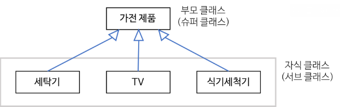
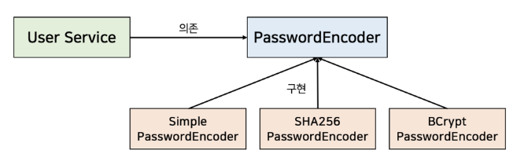

## 객체지향설계가 중요한 이유

객체지향설계의 가장 큰 이점은 **코드의 재사용성과 이식성**에 있다고 생각한다. 특히, 임베디드 개발자로서 특정 하드웨어 플랫폼에만 국한되지 않고 다양한 제품들을 하나의 소스코드에서 지원할 수 있다면 개발시간 단축, 유지보수의 용이함 등 다양한 장점들을 챙겨갈 수 있다.

## 절차지향프로그래밍 vs 객체지향프로그래밍

절차지향 언어를 사용한다면 `실행순서, 절차` 더 중점이 되고, 객체지향 언어를 사용한다면 `필요한 객체들의 종류와 속성` 등이 더 중점이 된다. 즉, 서로 반대되는 개념이 아니라 설계 목적에 차이가 있다.

절차지향 언어는 로직의 절차가 더 중요하다. 자판기에서 커피를 뽑을 때도 절차지향 언어는 **동전 투입 → 금액 확인 → 상품 선택 → 재고 확인 → 상품 전달** 와 같이 로직 순서를 더 중점으로 생각하면 된다.

객체지향 언어는 로직을 구성하는 속성을 객체화한다. 자판기에서 커피를 뽑는 로직을 구현할 때도 **돈통, 물통, 버튼, 디스플레이** 등 객체가 중점이 된다.

### 절차지향프로그래밍
- 물이 위에서 아래로 흐르는 것처럼 순차적인 처리가 중요시되며 프로그램 전체가 유기적으로 연결되도록 만드는 프로그래밍 기법을 의미한다.
- 컴퓨터의 작업 처리 방식과 유사하기 때문에 객체지향 언어에 비해 처리 속도가 빠르다.
- 함수 단위로 데이터를 처리하기 때문에 호출 순서가 중요하다.
- 유지보수와 디버깅 작업이 어려울 수 있다.

### 객체지향프로그래밍
- 데이터와 절차를 하나의 덩어리로 묶어서 생각한다.
- 기능별로 묶어 모듈화를 함으로써 하드웨어가 같은 기능을 중복으로 연산하지 않도록 하고, 모듈을 재활용하기 때문에 하드웨어의 처리량을 획기적으로 늘려준다.
- 어떤 모듈에 있는 하나의 기능만 필요하더라도 모듈 전체를 가져와야 하기 때문에 절차지향프로그래밍보다 프로그램 사이즈가 더 커질 수 있다.
- `추상화`
    - 복잡한 시스템으로부터 핵심적인 개념 또는 기능을 간추려내는 것이다.
    - 추상화가 잘 되어 있으면 기존에 구현된 코드를 유지한 채 새로운 기능을 유연하게 확장할 수 있다.
- `캡슐화`
    - 객체의 속성과 메서드를 하나로 묶고 일부를 외부에 감추어 은닉하는 것이다. → **정보은닉**
    - 필요한 데이터만 외부에 공개함으로써 보안성을 높일 수 있다.
- `상속성`
    - 상위 클래스의 특성을 하위 클래스가 이어받아서 재사용하거나 추가, 확장하는 것이다.
    - 코드의 재사용 측면, 계층적인 관계 생성, 유지 보수성 측면에서 중요하다.
    - **IS-A 관계 - Laptop(부모 클래스) is a Computer(자식 클래스)**

    

- `다형성`
    - 하나의 메서드나 클래스가 다양한 방법으로 동작하는 것을 의미한다.
    - 오버로딩: 같은 이름을 가진 메서드를 여러 개 둘 수 있다..
    - 오버라이딩: 상위 클래스로부터 상속받은 메서드를 하위 클래스가 재정의할 수 있다.
    - **추상 클래스(Abstract Class)와 가상함수(Virtual Function)**
        - 클래스 중에는 객체 생성을 목적으로 정의되지 않는 클래스도 존재한다. 이를 추상 클래스라고 부르고 인터페이스 역할을 한다.
        - 추상 클래스의 경우 멤버함수를 순수 가상함수로 선언하여 객체 생성을 문법적으로 막는 것이 좋다.
        - 함수의 몸체는 하위 클래스에서 오버라이딩한다.

#### 접근제어지시자(public, protected, private)
- `public`
    - 본인 멤버함수에서 접근 ⭕
    - 자식 클래스 멤버함수에서 접근 ⭕
    - 외부에서 객체를 통해 접근 ⭕
- `protected`
    - 본인 멤버함수에서 접근 ⭕
    - 자식 클래스 멤버함수에서 접근 ⭕
    - 외부에서 객체를 통한 접근 ❌
- `private`
    - 본인 멤버함수에 접근 ⭕
    - 자식 클래스 멤버함수에서 접근 ❌
    - 외부에서 객체를 통한 접근 ❌
- 상속관계

| 부모 클래스 멤버 | public 상속 | protected 상속 | private 상속 |
| --- | --- | --- | --- |
| public | public | protected | private |
| protected | protected | protected | private |
| private | ❌ | ❌ | ❌ |

## SOLID 원칙
- `단일 책임의 원칙(SRP, Single Responsibility Principle)`
    - 모듈이 변경되는 이유가 한가지여야 한다.
    - 해당 모듈이 여러 대상 또는 액터들에 대해 책임을 가져서는 안되고, 오직 하나의 액터에 대해서만 책임을 져야 한다.
    - 이 원칙을 제대로 지키면 변경이 필요할 때 수정할 대상이 명확해진다.
- `개방 폐쇄 원칙(OCP, Open-Closed Principle)`
    - 확장에 대해 열려있고 수정에 대해서는 닫혀있어야 한다는 원칙
    - 확장에 대해 열려 있다.
        - 요구사항이 변경될 때 새로운 동작을 추가하여 애플리케이션의 기능을 확장할 수 있다.
    - 수정에 대해 닫혀 있다.
        - 기존의 코드를 수정하지 않고 애플리케이션의 동작을 추가하거나 변경할 수 있다.
    - 이 원칙을 지키기 위해서는 **추상화**에 의존해야 한다. 추상화란 핵심적인 부분만 남기고, 불필요한 부분은 제거함으로써 복잡한 것을 간단히 하는 것이고, 추상화를 통해 변하지 않는 부분만 남김으로써 기능을 구체화하고 확장할 수 있다.
- `인터페이스 분리 원칙(ISP, Interface Segregation Principle)`
    - 클라이언트의 목적과 용도에 적합한 인터페이스만을 제공한다.
    - 모든 클라이언트가 자신의 관심에 맞는 public interface(외부에서 접근이 가능한 메세지)만을 접근하여 불필요한 간섭을 최소화할 수 있다.
- `리스코프 치환 원칙(LSP, Liskov Substitution Principle)`
    - 하위 타입은 상위 타입을 대체할 수 있어야 한다.
    - 해당 객체를 사용하는 클라이언트는 상위 타입이 하위 타입으로 변경되어도 차이점을 인식하지 못한 채 상위 타입의 퍼블릭 인터페이스를 통해 서브 클래스를 사용할 수 있어야 한다.
    - 자식 클래스가 부모 클래스 대신 사용될 수 있어야 한다.
- `의존 역전 원칙(DIP, Dependency Inversion Principle)`
    - 객체 지향 프로그래밍에서는 객체들 사이에 메세지를 주고 받기 위해 의존성이 생기는데, 이 원칙은 올바른 의존 관계를 위한 원칙에 해당된다.
    - 고수준 모듈은 저수둔 모듈의 구현에 의존해서는 안되며, **저수준 모듈이 고수준 모듈에 의존해야 한다**는 것이다.
    - 개방 폐쇄 원칙과 밀접한 관련이 있으며, 의존 역전 원칙이 위배되면 개방 폐쇄 원칙 역시 위배될 가능성이 높다.
    - 의존 역전 원칙에서 의존성이 역전되는 시점은 컴파일 시점이다. 런타임 시점에서는 UserService가 SHA256PasswordEncoder라는 구체 클래스에 의존한다.
    
    
    

#### Reference.

[블로그 - 망나니개발자](https://mangkyu.tistory.com/194)

[블로그 - (비)전공자](https://blackvill.tistory.com/221)

